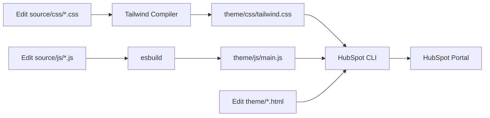

FreshJuice DEV uses a modern build pipeline that compiles Tailwind CSS, bundles JavaScript with esbuild, and syncs files to HubSpot using the HubSpot CLI.

## Build Pipeline Overview

The build process consists of three main tools working together:

<CardGroup cols={3}>
  <Card title="Tailwind CSS" icon="paintbrush">
    Compiles utility-first CSS from source files
  </Card>
  <Card title="esbuild" icon="cube">
    Bundles JavaScript modules with Alpine.js
  </Card>
  <Card title="HubSpot CLI" icon="upload">
    Uploads and watches theme files
  </Card>
</CardGroup>

## NPM Scripts

All build commands are defined in `package.json` and orchestrated using `npm-run-all`:

<CodeGroup>
```json package.json (excerpt)
{
  "scripts": {
    "clean": "rimraf './_temp' './_dist' && mkdir './_temp' './_dist'",
    
    "fetch:hubspot": "hs fetch --overwrite /FreshJuice ./theme && ./scripts/post-fetch.sh",
    "upload:hubspot": "hs upload ./theme /FreshJuiceDEV",
    "watch:hubspot": "hs watch ./theme /FreshJuiceDEV",
    
    "watch:tailwind": "npx @tailwindcss/cli -i ./source/css/tailwind.css -o ./theme/css/tailwind.css --watch",
    "build:tailwind": "npx @tailwindcss/cli -i ./source/css/tailwind.css -o ./theme/css/tailwind.css",
    
    "watch:js": "npx esbuild ./source/js/main.js --outfile=./theme/js/main.js --bundle --watch",
    "build:js": "npx esbuild ./source/js/main.js --outfile=./theme/js/main.js --bundle",
    
    "build:zip": "./scripts/build-zip.sh",
    
    "version:patch": "./scripts/bump-theme-version.sh patch",
    "version:minor": "./scripts/bump-theme-version.sh minor",
    "version:major": "./scripts/bump-theme-version.sh major",
    
    "start": "npm-run-all --parallel watch:*",
    "build": "npm-run-all --serial clean build:js build:tailwind build:zip"
  }
}
```
</CodeGroup>

## Development Workflow

### Starting Development

The `npm run start` command runs all watch tasks in parallel:

```bash
npm run start
```

This executes three processes simultaneously:

<Steps>
  <Step title="watch:tailwind">
    Watches for changes in CSS files and recompiles Tailwind
  </Step>
  <Step title="watch:js">
    Watches for changes in JavaScript files and rebuilds the bundle
  </Step>
  <Step title="watch:hubspot">
    Watches the theme directory and uploads changes to HubSpot
  </Step>
</Steps>

<Info>
  The `npm-run-all --parallel` command ensures all three processes run concurrently, providing instant feedback during development.
</Info>

### File Watching Flow



## Tailwind CSS Compilation

### Input Configuration

Tailwind scans multiple sources for class names:

<CodeGroup>
```css source/css/tailwind.css
@import "tailwindcss" source(none);

/* Tailwind scans these paths for class names */
@source "../../theme/**/*.html";
@source "../../theme/**/*.js";
@source "../js/farmerswife.js";
@source "./**/*.css";

@theme {
  /* Custom CSS variables */
  --color-cursor: #FFFFFF;
  --color-terminal: #000000;
  --font-cursive: "Caveat", cursive;
}

/* Layer imports */
@import "./base/reset.css";
@import "./base/typography.css";
@import "./components/system.css";
```
</CodeGroup>

### Compilation Process

<Tabs>
  <Tab title="Development">
    Development mode with watch flag:
    
    ```bash
    npx @tailwindcss/cli \
      -i ./source/css/tailwind.css \
      -o ./theme/css/tailwind.css \
      --watch
    ```
    
    Features:
    - Fast incremental builds
    - Source maps for debugging
    - Instant recompilation on file changes
  </Tab>
  
  <Tab title="Production">
    Production build without watch:
    
    ```bash
    npx @tailwindcss/cli \
      -i ./source/css/tailwind.css \
      -o ./theme/css/tailwind.css
    ```
    
    Features:
    - Optimized output
    - Minified CSS
    - Purged unused classes
  </Tab>
</Tabs>

### Custom Theme Configuration

The `@theme` directive extends Tailwind with custom design tokens:

```css
@theme {
  /* Custom colors */
  --color-cursor: #FFFFFF;
  --color-cursor-500: #FFFFFF;
  --color-terminal: #000000;
  --color-terminal-500: #000000;

  /* Custom fonts */
  --font-cursive: "Caveat", cursive;

  /* Custom spacing */
  --spacing-screenSinNav: calc(100vh - 5rem);

  /* Aspect ratios */
  --aspect-video: 16 / 9;
  --aspect-golden: 1.6180 / 1;
  --aspect-macbook: 16 / 10;
}
```

<Tip>
  Use CSS custom properties in the `@theme` directive to create reusable design tokens that can be referenced throughout your theme.
</Tip>

## JavaScript Bundling with esbuild

### Bundle Configuration

esbuild bundles all JavaScript modules into a single file:

```bash
npx esbuild ./source/js/main.js \
  --outfile=./theme/js/main.js \
  --bundle \
  --watch  # Only in development
```

### Entry Point

The main JavaScript file imports all dependencies:

<CodeGroup>
```javascript source/js/main.js
import debugLog from './modules/_debugLog';
import loadScript from './modules/_loadScript';
import flyingPages from "flying-pages-module";
import Alpine from "alpinejs";
import intersect from "@alpinejs/intersect";
import collapse from "@alpinejs/collapse";
import focus from "@alpinejs/focus";
import dataDOM from "./modules/Alpine.data/DOM";

// Make Alpine available globally
window.Alpine = Alpine;

// Register Alpine plugins
Alpine.plugin(intersect);
Alpine.plugin(collapse);
Alpine.plugin(focus);

// Register Alpine data
Alpine.data("xDOM", dataDOM);

// Initialize on DOM ready
domReady(() => {
  Alpine.start();
  flyingPages({});
});
```
</CodeGroup>

### Bundled Dependencies

All npm packages are bundled into the output:

<AccordionGroup>
  <Accordion title="Alpine.js (Core)">
    ```json
    "alpinejs": "^3.14.9"
    ```
    Minimal JavaScript framework for declarative interactivity
  </Accordion>
  
  <Accordion title="Alpine.js Plugins">
    ```json
    "@alpinejs/collapse": "^3.14.9",
    "@alpinejs/focus": "^3.14.9",
    "@alpinejs/intersect": "^3.14.9"
    ```
    Official Alpine.js plugins for common patterns
  </Accordion>
  
  <Accordion title="Performance Utilities">
    ```json
    "flying-pages-module": "^2.1.4"
    ```
    Prefetches pages to speed up navigation
  </Accordion>
  
  <Accordion title="Third-Party Embeds">
    ```json
    "lite-youtube-embed": "^0.3.3"
    ```
    Lightweight YouTube embeds for better performance
  </Accordion>
</AccordionGroup>

### Bundle Output

The compiled bundle is placed in `theme/js/main.js` and included in the base template:

```html
{{ require_js(get_asset_url("../../js/main.js"), { position: "footer", defer: true }) }}
```

<Note>
  esbuild is extremely fast, typically bundling in milliseconds. This makes the watch mode highly responsive during development.
</Note>

## HubSpot CLI Integration

### Authentication

Before using HubSpot CLI commands, authenticate with your portal:

```bash
hs auth
```

### Common Operations

<Tabs>
  <Tab title="Watch">
    Continuously upload changes during development:
    
    ```bash
    npm run watch:hubspot
    # Or directly:
    hs watch ./theme /FreshJuiceDEV
    ```
    
    - Monitors `./theme` directory
    - Uploads changes automatically
    - Shows upload status in terminal
  </Tab>
  
  <Tab title="Upload">
    One-time upload of all theme files:
    
    ```bash
    npm run upload:hubspot
    # Or directly:
    hs upload ./theme /FreshJuiceDEV
    ```
    
    - Uploads entire theme directory
    - Overwrites existing files
    - Use after major changes
  </Tab>
  
  <Tab title="Fetch">
    Download theme files from HubSpot:
    
    ```bash
    npm run fetch:hubspot
    # Or directly:
    hs fetch --overwrite /FreshJuice ./theme
    ```
    
    - Downloads from HubSpot portal
    - Runs post-fetch cleanup script
    - Useful for syncing changes
  </Tab>
</Tabs>

### Portal Configuration

The HubSpot CLI uses `hubspot.config.yml` for portal settings:

```yaml
defaultPortal: production
portals:
  - name: production
    portalId: 12345678
    authType: personalaccesskey
    auth:
      tokenInfo:
        accessToken: your-access-token
```

<Warning>
  Never commit `hubspot.config.yml` with authentication tokens. Add it to `.gitignore` to prevent accidental exposure.
</Warning>

## Production Build

### Full Build Process

Run a complete production build:

```bash
npm run build
```

This executes the following steps sequentially:

<Steps>
  <Step title="clean">
    Remove `_temp/` and `_dist/` directories, then recreate them
    ```bash
    rimraf './_temp' './_dist' && mkdir './_temp' './_dist'
    ```
  </Step>
  
  <Step title="build:js">
    Bundle JavaScript with esbuild (production mode)
    ```bash
    npx esbuild ./source/js/main.js --outfile=./theme/js/main.js --bundle
    ```
  </Step>
  
  <Step title="build:tailwind">
    Compile Tailwind CSS (production mode with minification)
    ```bash
    npx @tailwindcss/cli -i ./source/css/tailwind.css -o ./theme/css/tailwind.css
    ```
  </Step>
  
  <Step title="build:zip">
    Create distribution ZIP file
    ```bash
    ./scripts/build-zip.sh
    ```
  </Step>
</Steps>

### Distribution Package

The build creates a versioned ZIP file ready for distribution:

```plaintext
_dist/
└── freshjuice-dev-hubspot-theme-v3.0.0-dev.zip
```

This ZIP contains the complete `theme/` directory and can be:
- Uploaded to HubSpot Design Manager
- Shared with clients or team members
- Archived for version control

## Version Management

### Bumping Version Numbers

Use semantic versioning scripts:

<CodeGroup>
```bash Patch (3.0.0 → 3.0.1)
npm run version:patch
```

```bash Minor (3.0.0 → 3.1.0)
npm run version:minor
```

```bash Major (3.0.0 → 4.0.0)
npm run version:major
```
</CodeGroup>

The version script updates:
- `package.json` version number
- Theme metadata files
- Git tags (if in a git repository)

## Build Optimization

### Performance Tips

<CardGroup cols={2}>
  <Card title="Tailwind Optimization" icon="bolt">
    - Only import needed CSS layers
    - Use `@source` to limit scan paths
    - Leverage JIT mode for smaller builds
    - Remove unused `@import` statements
  </Card>
  
  <Card title="JavaScript Optimization" icon="rocket">
    - Import only used Alpine plugins
    - Tree-shake unused dependencies
    - Use dynamic imports for heavy modules
    - Minimize third-party dependencies
  </Card>
  
  <Card title="HubSpot CLI Tips" icon="circle-check">
    - Use `watch` during active development
    - Upload only when making large changes
    - Exclude files with `.hsignore`
    - Test locally before uploading
  </Card>
  
  <Card title="Caching Strategy" icon="database">
    - Leverage HubSpot's CDN caching
    - Use versioned asset URLs
    - Set appropriate cache headers
    - Invalidate cache after major updates
  </Card>
</CardGroup>

## Troubleshooting

<AccordionGroup>
  <Accordion title="Tailwind classes not applying">
    **Cause**: Files not included in `@source` directives
    
    **Solution**: Add the file path to `source/css/tailwind.css`:
    ```css
    @source "../../theme/path/to/your/file.html";
    ```
  </Accordion>
  
  <Accordion title="JavaScript bundle errors">
    **Cause**: Missing dependencies or import errors
    
    **Solution**: Check that all imports are valid:
    ```bash
    npm install  # Reinstall dependencies
    npm run build:js  # Run build to see detailed errors
    ```
  </Accordion>
  
  <Accordion title="HubSpot upload failures">
    **Cause**: Authentication issues or file permissions
    
    **Solution**: Re-authenticate and check file paths:
    ```bash
    hs auth  # Re-authenticate
    hs upload ./theme /FreshJuiceDEV --debug  # Upload with debug info
    ```
  </Accordion>
  
  <Accordion title="Build taking too long">
    **Cause**: Too many files being scanned or watched
    
    **Solution**: Optimize `@source` paths and use `.hsignore`:
    ```plaintext .hsignore
    node_modules/
    _temp/
    _dist/
    .git/
    ```
  </Accordion>
</AccordionGroup>

## Best Practices

<Warning>
  Always run `npm run start` during active development to ensure changes are compiled and uploaded in real-time.
</Warning>

<Steps>
  <Step title="Use watch mode">
    Keep all watchers running during development for instant feedback
  </Step>
  
  <Step title="Test builds locally">
    Run `npm run build` before deploying to catch compilation errors
  </Step>
  
  <Step title="Version consistently">
    Use the version scripts to maintain semantic versioning
  </Step>
  
  <Step title="Clean before major builds">
    Run `npm run clean` if you encounter caching issues
  </Step>
</Steps>

## Related Resources

<CardGroup cols={2}>
  <Card title="Project Structure" icon="folder-tree" href="/concepts/project-structure">
    Understand where files are located
  </Card>
  <Card title="Theme Architecture" icon="diagram-project" href="/concepts/theme-architecture">
    Learn how components work together
  </Card>
</CardGroup>